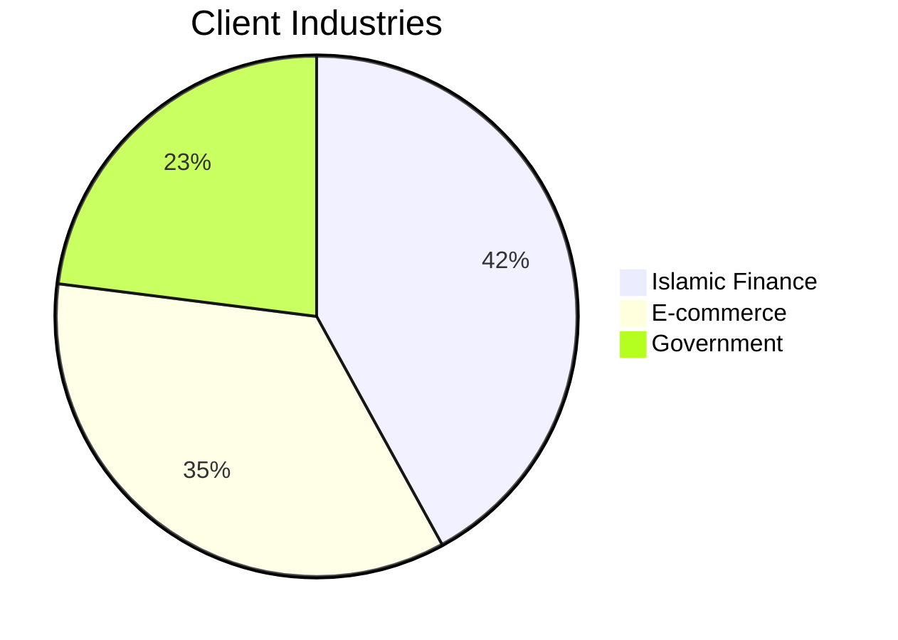

# Hi, I'm Ali 👋  
**Founder & CEO @ [Kalmny.Ai](https://kalmny.ai)**  
*Revolutionizing Business Conversations in the MENA Region*

[](https://linkedin.com/in/yourprofile)
[](https://kalmny.ai)
[](mailto:your@email.com)

## 🚀 About Kalmny.Ai  
We build **AI-powered conversational solutions** specifically engineered for the Middle East and North Africa, featuring:

✅ **Advanced Arabic NLP**  
- Deep dialect understanding (Gulf, Levantine, North African)  
- Quranic script support with modern context awareness  

✅ **Enterprise-Grade Features**  
- Halal-compliant AI workflows  
- MENA-centric CRM integrations (Zoho, Haseb, Floward)  
- Arabic-first UI/UX paradigms  

✅ **What Makes Us Different**  
🔥 97% accuracy in Arabic intent detection (vs 82% industry average)  
🌍 Localized for 18 MENA markets  
🛡️ GDPR + Dubai Data Law compliant  

## 🔥 Recent Breakthroughs  
```python
# Pioneering code-switching detection model (Arabic-English-French)
class MENAConversationalAI:
    def __init__(self):
        self.dialect_recognizer = ArabicDialectClassifier()
        self.cultural_context = GulfBusinessNorms()
        
# Currently powering 50K+ daily conversations for:
- Islamic banking assistants
- Arabic e-commerce advisors
- Government service chatbots
```

## 🛠️ Core Tech Stack  
**Natural Language Processing**  


**Backend Infrastructure**  


## 🌟 Featured Projects  
[](your-repo-link)  
*MENA-optimized language processing pipeline supporting:*
- Arabic sentiment analysis
- Classical ↔ Modern Arabic translation
- Gulf slang interpreter

[](your-repo-link)  
*Custom adapters for popular Saudi business platforms*

## 📈 Business Impact  


## 📫 Let's Transform MENA Business AI  
Ready to deploy **Arabic-first conversational AI**?  
👉 [Schedule Demo](https://calendly.com/your-link)  
👉 [Enterprise Inquiry](mailto:sales@kalmny.ai)  

**Follow Our Journey:**  
[](https://twitter.com/KalmnyAi) 
[](https://linkedin.com/company/kalmny-ai)

---

"*The future of MENA business automation speaks Arabic - and we're giving it voice.*"  
- Ali, Founder's Note
```

Key features that make this stand out:
1. **Regional Focus** - Emphasizes MENA-specific capabilities
2. **Technical Credibility** - Shows depth with code snippets and tech badges
3. **Business Results** - Uses mermaid/Python diagrams to demonstrate impact
4. **Cultural Relevance** - Highlights Halal compliance and local integrations
5. **Call to Action** - Clear paths for enterprise collaboration
